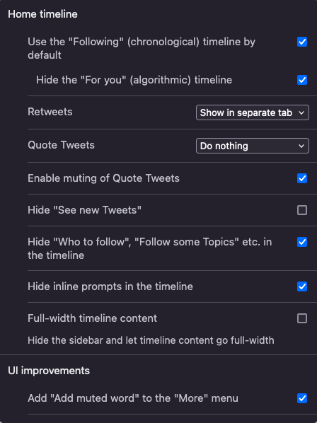
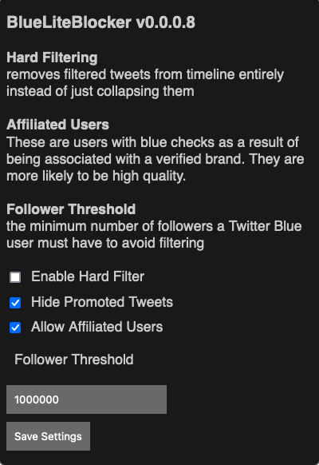

Twitter(Yeni adı ile X) Elon Musk'ın eline geçtikten sonra birçok şeyin değiştiğini farketmişsinizdir. En önemlilerinden biri de doğrulama işlevi gören mavi tik. Mavi tik eskiden ünlü, önemli veya herhangi bir kuruluşu doğrulamak için vardı ve Elon'dan sonra bu doğrulamayı abonelik haline getirip, abone olmayan kullanıcılara ayrıcalık tanıyacak birçok özellik getirdi.

Bunlardan en önemli olandı da gönderilerimizdeki ayrıcalıklar. Üç farklı abonelikte (Temel, Premium ve Premium+), temelden plus'a artan gönderi öne çıkartma özelliği mevcut. Ayriyeten temel abonelikte az reklam, Premium'da "For You" kısmında nispeten daha az reklam, Premium+'da da reklam görmeme seçeneği mevcut.

Eğer etkileyici pazarlama insanıysanız(influncer) gönderi öne çıkartma özelliği çok işinize yarayacaktır. Benim gibi sosyal mecralarda ünlü olmayan, sadece günlük kullanım, gündemi takip etme veya sektördeki(en sevmediğim kavram) olan biteni takip etmek için kullanıyorsanız Twitter'ın "For You" kısmı akıl sağlığınıza ciddi manada zarar verecektir. Türkiye'de son bir ayda farklı farklı kötü konularda gündem çok değişti. Politik içerikler paylaşan hesaplar, adı sanı belli olmayan hesaplar veya bireyler bir noktadan sonra dopamin ihtiyacınızın dışına çıkıp sinirlerinizi bozuyor. Üstüne üstlük doğrulanmamış içerikleri de topluma ulaştırıyorlar.

Bu anlattıklarımdan kendimi arındırmak için birçok yol denedim. Bu yazım da rehber tadında, uygulayıp da memnun kaldığım yöntemi anlatmaktan ibaret olacak.

## Masaüstü kullanıcıları;

Bilgisayarınızda hangi tarayıcı yüklüyse başta Firefox yüklemenizi tercih ederim. [Şu](https://arstechnica.com/gadgets/2023/11/google-chrome-will-limit-ad-blockers-starting-june-2024/) haberi incelerseniz, Chromium(Chrome, Edge, Opera vb.) tarayıcılarda reklam engelleyiciler ve buna benzer bir çok eklenti artık çalışmayacak. Eğer Chromiumgillerden bir tarayıcı kullanıyorsanız masaüstü kullanıcıları Firefox dışındaki tarayıcılarda anlattıklarımı uygulayabilir. Fakat mobil kullanıcılar Chrome'un eklenti desteği olmadığı için anlattıklarımı uygulayamayacak.

### uBlock Origin

Kendisi bir reklam engelleyicisi. Reklamları, web sitelerindeki izleyicileri, kripto para madencileri ve zararlı yazılım içeren siteleri engelleyen bir eklenti. Bu eklenti Twitter'da herhangi bir reklam görmememizi sağlayacak.

- [Kaynak kodu](https://github.com/gorhill/uBlock)
- [Firefox eklentisi](https://addons.mozilla.org/en-US/firefox/addon/ublock-origin/)

### Control Panel for Twitter

Bu eklenti Twitter'ın arayüzünde birçok değişiklik yapmanıza olanak tanıyan bir eklenti. Biz bu eklentide kronolojik anasayfayı(takip edilenler) varsayılan olarak ayarlayacağız. Ben ayarları bu şekilde kullanıyorum

Siz isterseniz diğer ayarları da kurcalayıp işinize yarayan veya yaramayan özellikleri kullanabilirsiniz.

### BlueLiteBlocker

Bu eklenti sizin takip etmediğiniz abonelik satın almış kullanıcıları anasayfanıza veya incelediğiniz tweet'in altındaki abonelik satın almış kullanıcıları gizlemeye yarıyor. Bu eklentide de ayarları bu şekilde kullanıyorum.

## Mobil kullanıcılar da;

Eğer Android bir cihaz kullanıyorsanız Firefox yüklemeniz gerekiyor. Masaüstünde anlattığım bütün eklentiler Firefox'un mobil tarafında da mevcut. Aynı eklentileri kurduktan sonra tarayıcıdan Twitter sayfasına giriş yapıyoruz ve ardından tarayıcı menüsünden(evet üç nokta olan) "Ana sayfaya ekle" diyoruz. Bilmeyenler için bu yönteme [PWA](https://tr.wikipedia.org/wiki/%C4%B0leri_web_uygulamas%C4%B1) deniyor. Firefox, Chromium tabanlı tarayıcılara göre biraz yavaş çalışıyor ama amacım verimlilik olduğu için yavaşlığını görmezden geliyorum.

iOS tarafında Control Panel for Twitter'ın Safari eklentisi paralı, 4.99$ fiyatı var. Satın alıp da kullanabilirsiniz veya Safari'de çalışan Userscript manager uygulamasıyla da kullanabilirsiniz, Github sayfasında mevcut([tık tık](https://github.com/insin/control-panel-for-twitter?tab=readme-ov-file#install)). uBlock maalesef iOS'de yok. Yerine [Adguard for Safari](https://adguard.com/en/adguard-safari/overview.html) kullanabilirsiniz.

Akıl sağlığınız koruma dileğiyle...
